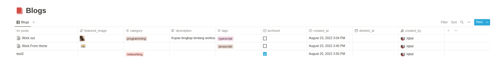

<h1 align="left"> NOTION API - Blogs [ Only Read ] </h1>
This api is made to make it easier to retrieve data from the notion database table

<br />

# Table of Contents

- [Table of Contents](#table-of-contents)
- [Tools Usage](#tools-usage)
- [Installation](#installation)
- [API Endpoint](#api-endpoint)

<br />

# Tools Usage

[](https://www.expressjs.com)
[](https://www.notion.io)

## dependencies

- Axios
- cors
- dotenv

<br />

# Installation

Create Database in your notion
**looks like this**


Install package

```
npm install
```

Create file .env (see .env.example for example variable)

```
Add **SECRET KEY** and **DATABASE ID** your notion
Add ID Table row your database notion
```

Run project

```
npm start
```

<br />

# API Endpoint

**Get All Post**

```
/api/v1/posts/all-posts
```

**Get Published Post**

```
/api/v1/posts/published
```

**Get Post by Category**<br/>
\*require params

```
/api/v1/posts/category/:categoryName
```

**Get Detail Post by Id**<br />
\*require params

```
/api/v1/posts/detail/:id
```

<br />

**Get All Category**<br />

```
/api/v1/properties/categories
```

**Get All Tags**<br />

```
/api/v1/properties/tags
```

<br />

### API Reference

https://www.getpostman.com/collections/61300315411c017769d4
